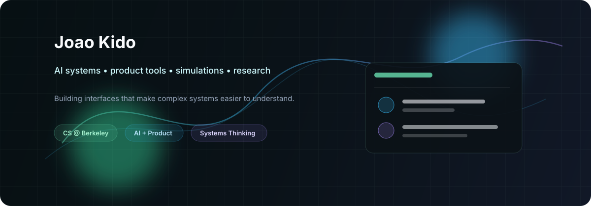

<p align="center">
  
</p>

<h1 align="center">Joao Kido</h1>

<p align="center">
  <a href="https://github.com/kidoexpress">
    
  </a>
</p>

<p align="center">
  
  <a href="https://github.com/kidoexpress?tab=repositories"></a>
  <a href="https://github.com/kidoexpress"></a>
</p>

---

### About

I am a CS and Economics student at UC Berkeley building at the intersection of AI systems, product design, simulations, and public-impact technology.

My favorite projects turn complicated systems into usable tools: models that explain what they are doing, interfaces that help people reason faster, and simulations that make tradeoffs visible instead of abstract. I care about the whole loop: research depth, engineering quality, product clarity, and whether the thing actually helps someone make a better decision.

Outside the obvious technical arc, I like ideas with texture: markets, sports, cities, education, health, and the strange little details that make a system behave differently than the diagram says it should.

---

### Current Focus

```txt
AI-assisted systems                    tools that reason with users, not around them
Economic simulations                   interactive models for policy and market tradeoffs
Computer vision                        detection, interpretation, and decision support
Product-oriented tools                 tight workflows, clean UX, useful constraints
Football analytics                     performance labs, tournament models, tactical signals
OS-like interfaces                     dashboards that feel like operating environments
```

---

### Technical Range

<p>
  
</p>

<table>
  <tr>
    <td><strong>AI / ML</strong></td>
    <td>model-assisted workflows, computer vision, applied reasoning systems, evaluation-minded prototypes</td>
  </tr>
  <tr>
    <td><strong>Product</strong></td>
    <td>interactive tools, user flows, UI systems, data-rich dashboards, experiment loops</td>
  </tr>
  <tr>
    <td><strong>Systems</strong></td>
    <td>simulation logic, database-backed apps, API design, structured data, decision engines</td>
  </tr>
</table>

---

### Featured Work

<table>
  <tr>
    <td width="50%">
      <h3>NeuroDetectAI</h3>
      <p>AI-assisted detection workflow focused on turning visual signals into clearer clinical decision support.</p>
      <p><strong>Stack:</strong> Python, CV, ML, product UX</p>
      <p><strong>Why it matters:</strong> makes high-stakes analysis easier to inspect, explain, and iterate.</p>
    </td>
    <td width="50%">
      <h3>World Cup Performance Lab</h3>
      <p>Interactive football analytics lab for comparing performance, match dynamics, and tournament scenarios.</p>
      <p><strong>Stack:</strong> TypeScript, React, analytics, visualization</p>
      <p><strong>Why it matters:</strong> converts sports data into tactical narratives and usable insights.</p>
    </td>
  </tr>
  <tr>
    <td width="50%">
      <h3>What If? Economic Simulator</h3>
      <p>Scenario engine for exploring how policy, market, and behavioral inputs change economic outcomes.</p>
      <p><strong>Stack:</strong> simulation logic, UI, data modeling</p>
      <p><strong>Why it matters:</strong> helps people reason through tradeoffs without pretending the world is linear.</p>
    </td>
    <td width="50%">
      <h3>Salvar o Amanhã</h3>
      <p>Public-impact project oriented around accessible tools, education, and civic or environmental action.</p>
      <p><strong>Stack:</strong> web, UX, storytelling, systems design</p>
      <p><strong>Why it matters:</strong> gives complex public problems a clearer interface for participation.</p>
    </td>
  </tr>
</table>

---

### GitHub Signal

<p align="center">
  
  
</p>

<p align="center">
  
</p>

<p align="center">
  
</p>

<!-- Snake animation appears after the included GitHub Action runs on the profile repository. -->
<p align="center">
  <picture>
    <source media="(prefers-color-scheme: dark)" srcset="https://raw.githubusercontent.com/kidoexpress/kidoexpress/output/github-contribution-grid-snake-dark.svg" />
    <source media="(prefers-color-scheme: light)" srcset="https://raw.githubusercontent.com/kidoexpress/kidoexpress/output/github-contribution-grid-snake.svg" />
    
  </picture>
</p>

---

### Operating Principles

```txt
Make the system visible.
Keep the interface calm.
Treat prototypes like arguments.
Design for the decision, not the demo.
Build things that get sharper when real people use them.
```

<p align="center">
  <a href="https://github.com/kidoexpress?tab=repositories">projects</a>
  ·
  <a href="https://github.com/kidoexpress">github</a>
  ·
  <a href="mailto:285597998+kidoexpress@users.noreply.github.com">contact</a>
</p>
